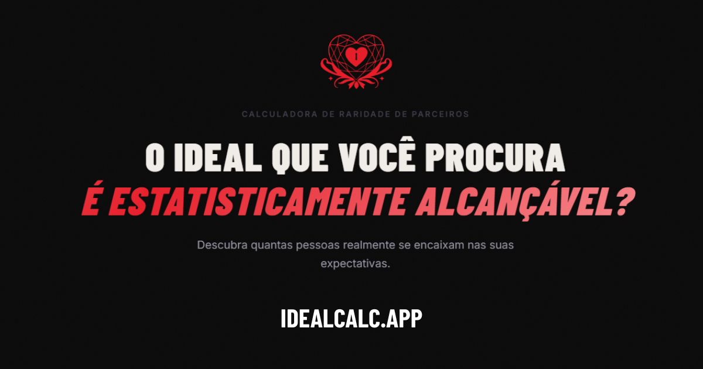
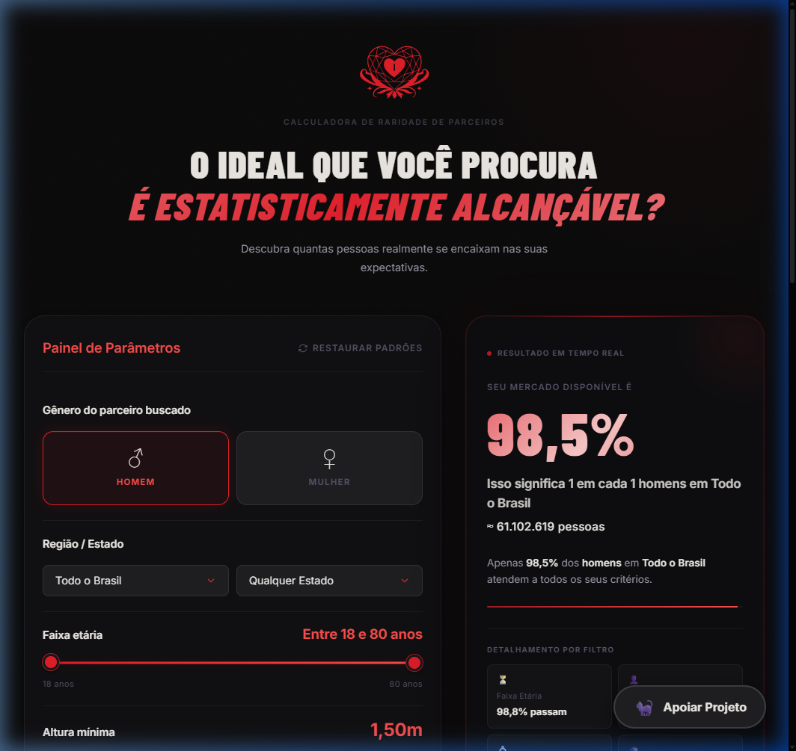
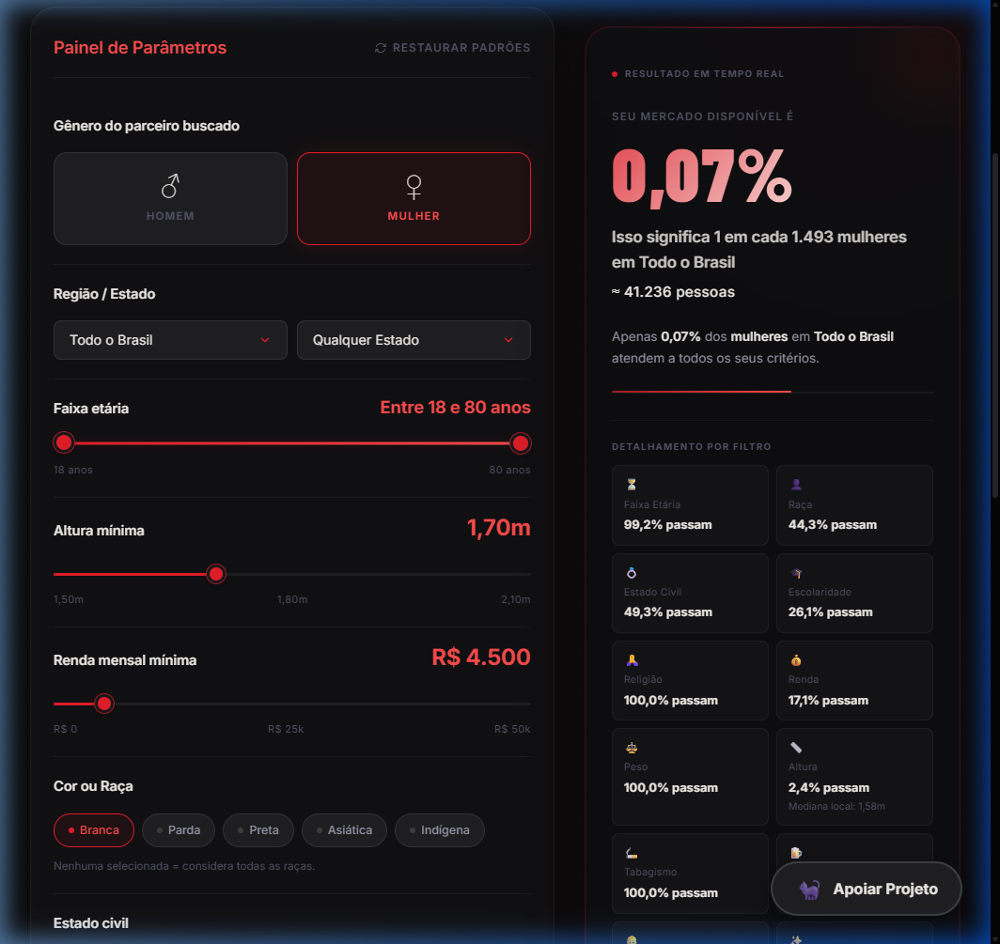
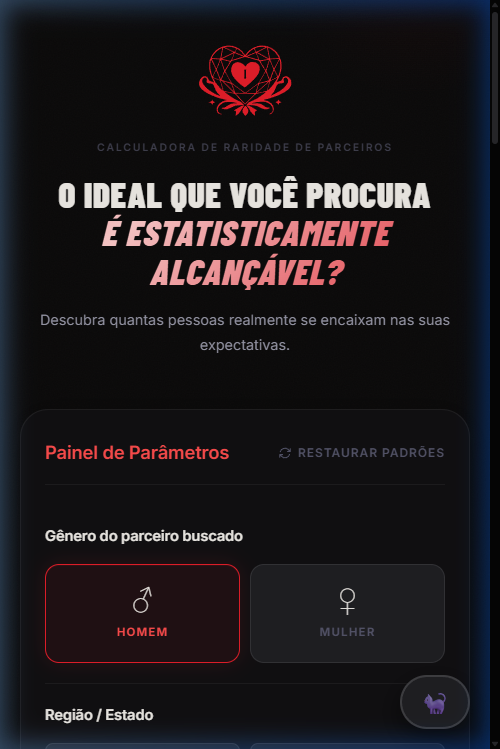
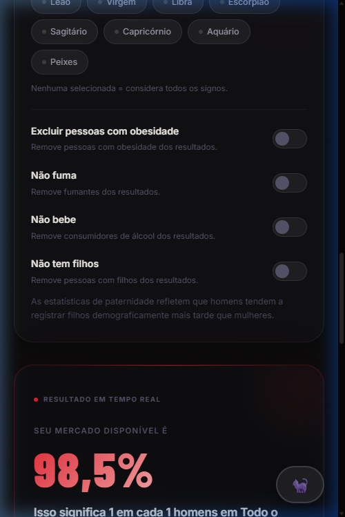
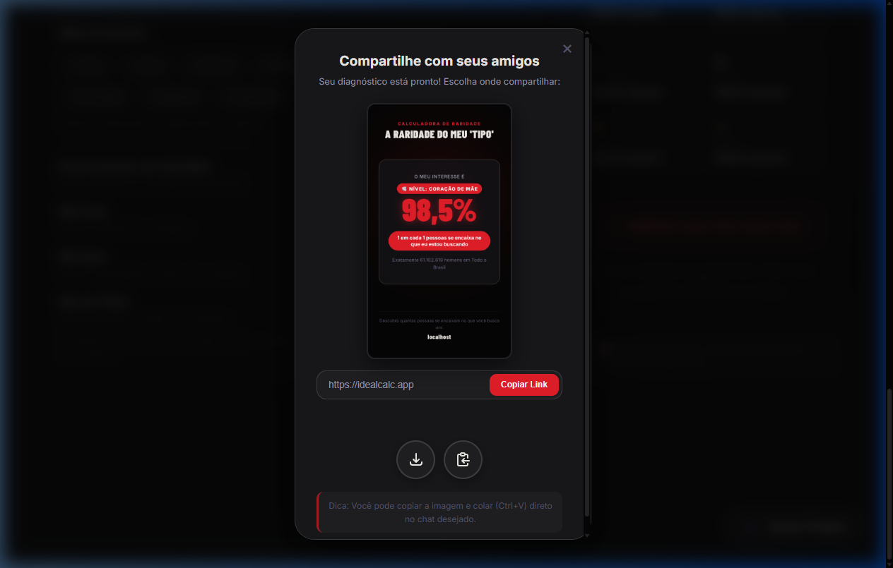
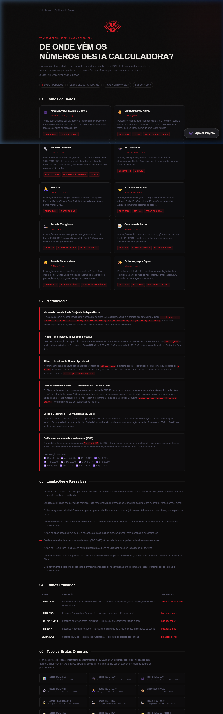
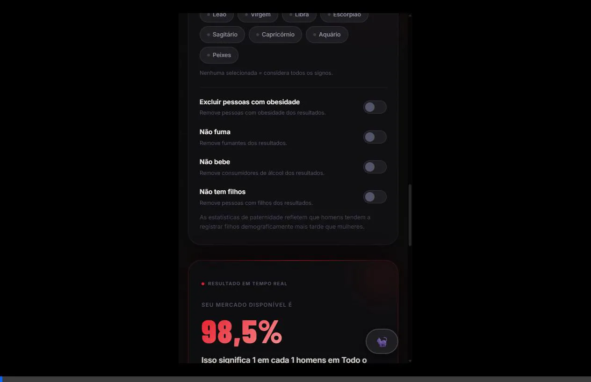

<p align="center">
  
</p>

<h1 align="center">💘 Calculadora de Raridade de Parceiros</h1>

<p align="center">
  <strong>Descubra quantas pessoas realmente se encaixam nas suas expectativas de relacionamento.</strong><br/>
  Uma ferramenta estatística interativa baseada em <b>microdados oficiais do IBGE</b>.
</p>

<p align="center">
  <a href="https://idealcalc.app">🌐 Acesse Online</a> ·
  <a href="#-demonstração">📸 Screenshots</a> ·
  <a href="#-como-funciona">🧮 Como Funciona</a> ·
  <a href="#-fontes-de-dados">📊 Fontes de Dados</a>
</p>

<p align="center">
  
  
  
  
</p>

---

## 📖 Sobre o Projeto

A **Calculadora de Raridade de Parceiros** é uma aplicação web que responde a uma pergunta provocativa: _"O ideal que você procura é estatisticamente alcançável?"_

Usando dados reais do **Censo Demográfico 2022**, **PNAD Contínua 2023**, **POF 2017-2018** e **PNS 2019**, a calculadora cruza **12 filtros demográficos** para calcular, em tempo real, qual porcentagem da população brasileira se encaixa nos seus critérios.

> **⚠️ Disclaimer:** Esta ferramenta é para fins **educacionais e de reflexão**. Não deve ser usada para discriminar pessoas ou tomar decisões reais de relacionamento.

---

## ✨ Funcionalidades

| Funcionalidade               | Descrição                                                                           |
| :--------------------------- | :---------------------------------------------------------------------------------- |
| 🔄 **Cálculo em Tempo Real** | Resultados atualizam instantaneamente ao ajustar qualquer filtro                    |
| 👤 **Gênero**                | Busca por homens ou mulheres                                                        |
| 🗺️ **Região / Estado**       | Filtragem por Região, Estado ou todo o Brasil                                       |
| ⏳ **Faixa Etária**          | Slider duplo de 18 a 80 anos                                                        |
| 📏 **Altura Mínima**         | Distribuição Normal com mediana por estado/gênero                                   |
| 💰 **Renda Mensal**          | Interpolação entre percentis P5–P99                                                 |
| 👤 **Cor / Raça**            | Branca, Parda, Preta, Asiática, Indígena                                            |
| 💍 **Estado Civil**          | Solteiro, Casado, Divorciado                                                        |
| 🎓 **Escolaridade**          | Fundamental, Médio, Superior (cascata inclusiva)                                    |
| 🙏 **Religião**              | Católica, Evangélica, Espírita, Matriz Africana, Sem Religião                       |
| ✨ **Signo**                 | Os 12 signos com frequência real de nascimentos (IBGE)                              |
| ⚖️ **Obesidade**             | Filtra por IMC ≥ 30 (toggle)                                                        |
| 🚬 **Tabagismo**             | Remove fumantes (toggle)                                                            |
| 🍺 **Álcool**                | Remove consumidores de álcool (toggle)                                              |
| 👶 **Filhos**                | Remove pessoas com filhos (toggle)                                                  |
| 📊 **Detalhamento**          | Breakdown individual de cada filtro                                                 |
| 🎴 **Card Compartilhável**   | Gera imagem para compartilhar nas redes sociais                                     |
| 📱 **Web Share API**         | Compartilhamento nativo em dispositivos móveis                                      |
| 📄 **Auditoria de Dados**    | Página dedicada com link para todas as fontes oficiais + downloads dos JSONs brutos |

---

## 📸 Demonstração

### 🖥️ Visão Desktop

A interface principal mostra o **Painel de Parâmetros** à esquerda e o **Resultado em Tempo Real** à direita:

<p align="center">
  
</p>

### 🎛️ Filtros em Ação

Com filtros mais restritivos aplicados (Mulher, 1.70m+, R$4.500+, Branca, Solteira, Superior), o mercado cai drasticamente para **0,07%** — apenas 1 em cada 1.493 mulheres:

<p align="center">
  
</p>

### 📱 Versão Mobile

Layout totalmente responsivo otimizado para smartphones:

<p align="center">
  
  &nbsp;&nbsp;&nbsp;
  
</p>

### 🎴 Modal de Compartilhamento

O sistema gera um card visual com seu diagnóstico para compartilhar nas redes sociais:

<p align="center">
  
</p>

### 📄 Auditoria de Dados

Página dedicada à transparência: todas as fontes, metodologia e limitações documentadas:

<p align="center">
  
</p>

---

## 🎬 Vídeos de Demonstração

### Ajustando Filtros em Tempo Real

> Demonstração de como os resultados mudam em tempo real ao ajustar gênero, altura, renda, raça, estado civil e escolaridade:

<p align="center">
  
</p>

### Compartilhando Resultados

> Demonstração do fluxo de compartilhamento: geração do card visual e modal com opções de download e share:

<p align="center">
  
</p>

---

## 🧮 Como Funciona

### Modelo Matemático

A calculadora usa um **modelo de probabilidade conjunta** assumindo independência condicional entre os filtros:

```
P_final = P(idade) × P(raça) × P(estado_civil) × P(escolaridade) × P(religião)
         × P(renda) × P(obesidade) × P(altura) × P(fumo) × P(álcool)
         × P(filhos) × P(signo)
```

### Metodologia por Filtro

| Filtro              | Método                                                                                                  |
| :------------------ | :------------------------------------------------------------------------------------------------------ |
| **Altura**          | Distribuição Normal `N(mediana, σ²)` com `σ = 7cm` (masc.) / `6cm` (fem.). Calcula `1 - Φ((H - μ) / σ)` |
| **Renda**           | Interpolação linear entre percentis P5–P99 do estado. Retorna `1 - CDF(rendaMin)`                       |
| **Idade**           | Proporção da pop. adulta (18+) dentro do intervalo selecionado, ponderada por faixa                     |
| **Estado Civil**    | Razão soma(status desejados) / soma(todos os status) por faixa etária                                   |
| **Escolaridade**    | Cascata inclusiva: Superior ⊂ Médio ⊂ Fundamental. Razão numerador/denominador                          |
| **Religião**        | Soma das religiões selecionadas / total por faixa etária                                                |
| **Raça**            | Proporção da pop. que pertence às raças selecionadas                                                    |
| **Signo**           | Frequência estatística de nascimentos por mês (Tabela 2612 IBGE)                                        |
| **Comportamentais** | Taxa de "sobrevivência" de cada filtro (PNS 2019 + Censo 2022)                                          |

### ⚠️ Limitações

- Os filtros são tratados como **independentes** — na realidade, renda e escolaridade são fortemente correlacionados
- Dados de renda são **per capita domiciliar**, não renda individual
- A distribuição de altura é **aproximada** (Normal) — para extremos, o erro pode ser maior
- Dados de religião, raça e estado civil referem-se à **autodeclaração** no Censo
- Taxa de obesidade é baseada em peso/altura **autodeclarados** (PNAD 2023)

---

## 📊 Fontes de Dados

Todos os dados são derivados de pesquisas públicas do IBGE:

| Arquivo             | Fonte            | Variáveis                                                  |
| :------------------ | :--------------- | :--------------------------------------------------------- |
| `estado_civil.json` | Censo 2022       | População por UF, gênero, faixa etária e estado civil      |
| `escolaridade.json` | Censo 2022       | Nível de instrução por UF, gênero, raça e faixa etária     |
| `religiao.json`     | Censo 2022       | Religião por UF, gênero e faixa etária (5 categorias)      |
| `renda.json`        | PNAD 2023        | Percentis de renda domiciliar per capita (P5–P99)          |
| `altura.json`       | POF 2017-2018    | Mediana de altura por UF, gênero e faixa etária            |
| `obesidade.json`    | PNAD 2023        | Taxa de obesidade (IMC ≥ 30) por UF, gênero e faixa        |
| `fumo.json`         | PNS 2019         | Taxa de não-fumantes por UF, gênero e faixa etária         |
| `alcool.json`       | PNS 2019         | Taxa de não-bebedores por UF, gênero e faixa etária        |
| `filhos.json`       | Censo 2022       | Taxa de sem filhos por UF, gênero e faixa etária           |
| `signos.json`       | Tabela 2612 IBGE | Frequência de nascimentos por mês → distribuição por signo |

> 📄 A página [`dados.html`](https://idealcalc.app/dados.html) documenta fontes, metodologia, limitações e oferece download dos JSONs brutos e das tabelas originais do IBGE.

---

## 🏗️ Arquitetura do Projeto

```
Ideal-Calculator/
├── index.html              # Página principal da calculadora
├── dados.html              # Página de auditoria e transparência dos dados
├── css/
│   └── style.css           # Sistema de design completo (49KB)
├── js/
│   ├── main.js             # Controlador da UI (eventos, DOM, modal de compartilhamento)
│   ├── calculator.js       # Cérebro matemático — funções puras de cálculo
│   └── dataService.js      # Serviço de carregamento dos JSONs
├── data/                   # Microdados do IBGE em formato JSON
│   ├── estado_civil.json
│   ├── escolaridade.json
│   ├── religiao.json
│   ├── renda.json
│   ├── altura.json
│   ├── obesidade.json
│   ├── fumo.json
│   ├── alcool.json
│   ├── filhos.json
│   └── signos.json
├── download/               # Tabelas brutas originais do IBGE (CSV)
└── assets/
    ├── idealCalc_logo.svg  # Logo do projeto
    ├── og-banner.png       # Imagem Open Graph para link preview
    ├── qrcode.png          # QR Code Pix (doação)
    └── gato.mp4            # Vídeo do gato para o modal de doação 🐈‍⬛
```

### Princípios de Design

- **Separação de responsabilidades**: `calculator.js` é totalmente puro (sem DOM), `main.js` é o controlador da UI
- **Cálculo em tempo real**: Debounce de 220ms nos sliders para UX fluida sem sobrecarregar
- **Animação suave**: Count-up com easing `easeOutExpo` para efeito dramático
- **Viral Loop**: Card compartilhável gerado via `html2canvas` + Web Share API nativa em mobile
- **Transparência**: Página `dados.html` como compromisso com auditabilidade

---

## 🚀 Como Rodar Localmente

### Pré-requisitos

- Um servidor HTTP local (a aplicação usa ES Modules que requerem servir via HTTP)

### Opção 1 — VS Code Live Server

1. Abra o projeto no VS Code
2. Instale a extensão **Live Server**
3. Clique em `Go Live` no rodapé

### Opção 2 — Node.js (http-server)

```bash
# Clone o repositório
git clone https://github.com/zAstergun/Ideal-Calculator.git
cd Ideal-Calculator

# Instale e rode o servidor
npx -y http-server . -p 8080 -c-1

# Acesse: http://localhost:8080
```

### Opção 3 — Python

```bash
# Python 3
python -m http.server 8080

# Acesse: http://localhost:8080
```

> ⚠️ **Importante:** Não abra o `index.html` diretamente no navegador (via `file://`). A aplicação usa ES Modules e requer um servidor HTTP.

---

## 🛠️ Stack Tecnológica

| Tecnologia                  | Uso                                                             |
| :-------------------------- | :-------------------------------------------------------------- |
| **HTML5**                   | Estrutura semântica com Open Graph + Twitter Cards              |
| **CSS3**                    | Design system customizado, glassmorphism, animações, responsivo |
| **JavaScript (ES Modules)** | Lógica de cálculo, DOM manipulation, Web Share API              |
| **html2canvas**             | Geração de imagem compartilhável a partir do template HTML      |
| **Google Fonts**            | Inter + Barlow Condensed                                        |
| **Zero frameworks**         | Vanilla JS — sem dependência de frameworks pesados              |

---

## 🤝 Contribuindo

Contribuições são bem-vindas! Se você encontrar bugs, tiver sugestões ou quiser melhorar a base de dados:

1. Faça um fork do projeto
2. Crie uma branch para sua feature (`git checkout -b feature/nova-feature`)
3. Commit suas mudanças (`git commit -m 'feat: adiciona nova feature'`)
4. Push para a branch (`git push origin feature/nova-feature`)
5. Abra um Pull Request

---

## 💜 Apoiar o Projeto

Este projeto é mantido por uma única pessoa. Se a ferramenta te ajudou ou divertiu, considere apoiar:

- 🐈‍⬛ **Pix** disponível dentro da calculadora (botão "Apoiar Projeto")
- ⭐ **Star** no repositório

---

## 📝 Licença

Este projeto está licenciado sob a [Licença MIT](https://opensource.org/licenses/MIT).
Veja o arquivo [LICENSE](LICENSE) para ler a licença completa (em inglês e português).
